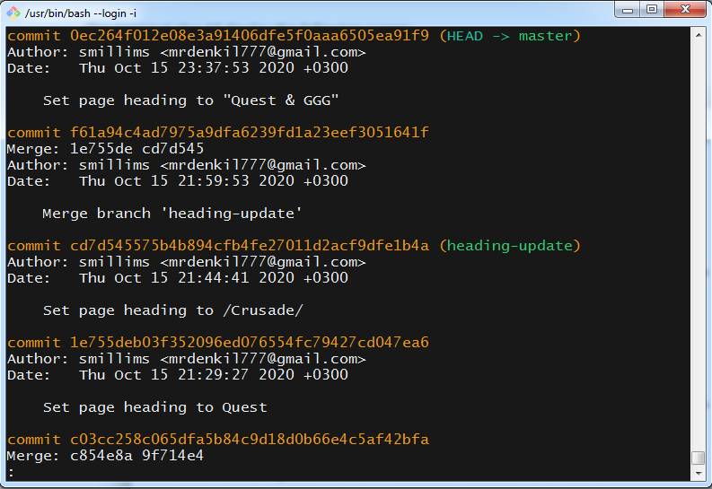
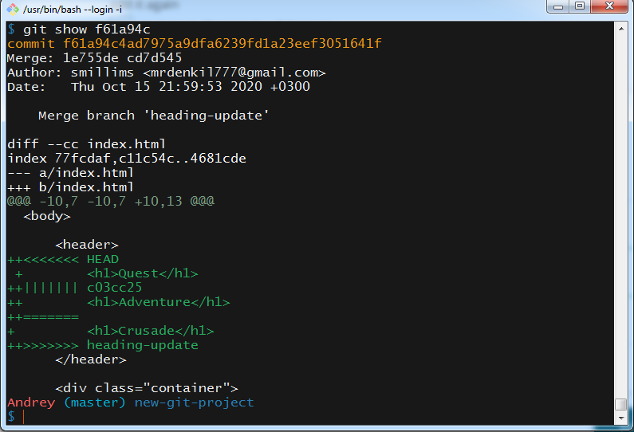

# kottans-frontend
In this repository I will write about the work with which I dealt and I will write reports on the lessons I have learned, so have fun (smile)


## Notes

- [X] *0. [Markdown](#)*
- [ ] *1. [Git Basics](#)*
   - [ ] *1.1 [Version Control with Git](#)*
   
## Markdown

   The first innovation that I have discovered for myself is that you need to use **markdown** formatting to edit text, and what's even funnier is that you need to style everything ***with your own hands***, without using pre-prepared buttons.

---

1. From the very beginning, everything was difficult and unusual, but after sitting and studying the information for two days I can say, that this is not such a difficult topic for me. Now I'm going to show you (and remind myself) some commands, each of which fulfills different functions.

- For examle you can stylized your own **header**:
   
   | Symbol | Heading text |
   | :--- | :---: |
   | `#` | Like `h1` header |
   | `###` | Like `h3` header |
   
   - and etc., when end at six `#` symblols

---

2. To your attantion I want to present command with which you're be able to use ordered/unordered **lists**. Above you can see example unordered lists. But from below will already be presented commands for created list:

```
- Kottans
- Front-end
- Course
```
- Kottans
- Front-end
- Course

```
1. Git
2. is a distributed
3. version-control system
```

1. Git
2. is a distributed
3. version-control system

---

3. Okay, let's move. Further I was shoked by creating **table**. Not the table itself, no no :grin:, specifically ***table creation***, I'll show you now:

   ```
   | HTML | CSS | JavaScript | Python |
   | --- | --- | --- | --- |
   | :heavy_check_mark: | :heavy_check_mark: | :x: | :x: |
   ```

   | HTML | CSS | JavaScript | Python |
   | --- | --- | --- | --- |
   | :heavy_check_mark: | :heavy_check_mark: | :x: | :x: |

   - The table shows the markup and program languages which I use/not use

---
---

***IN CONCLUSION***: Yeah, generally markdown it's basic, but in all that's information was new for me. I spent some of my time on learning, because of that I should to write about it here. On the whole, finishing. In notes I described just a little part of all, that I had to find out, not to mention stylized text (by the way, which I'm using), about code blocks (which I use too ! ), emogi, [design elements](https://shields.io/) and few different items.

---
---

## Git Basics
### Version Control with Git

----

> Git is a free and open source distributed version control system designed 
>> to handle everything from small to very large projects 
>>> with speed and efficiency.

----

***My expectations [course about Git](https://classroom.udacity.com/courses/ud123)***: I didn't know what to expact, besause before that I had no idea what is Git and what is he like (forgive me Mark Zuckerberg).

---

Let's break everything down:

- As soon as I have started lerning course and generelly found out what's version control system - I was very suprised. Exactly from that we use this system, I, and almost every   user use it for a long time and even didn't notice it. What I'm talking about? Do you know about this key combination as `ctrl + z`? Do you know what this key combination do?   It's used to undo the last action (for examle, to deletion text (i think you alredy knew it)).

  - Moreover this only a small part of version control system.

 - Then I had a difficult time for exposition terminology, here are some points:
   - Repository/repo: storage for storing your works (files), and few files, which are used for collaboration with Git.
   - A version control system (abbreviated as VCS) this is tool with which you can manage version control.
   - Branch - creation new branch for you repo in which you can safely change file that you need without touching a main branch.
     - Also you can merge branches, but let's speek about it a little bit later.
    
- After that installation Git on Windows, nothing complicated, everything okay.

- Further, at every lesson I have learnt different commands, similiarly i will sort this commands in different blocks.

---

#### Lesson 2: Create A Git Repo

   | Command | What is it mean? |
   | --- | --- |
   | `git init` | Create brand new repositories |
   | `git clone` | Copy existing repo from somewhere else to your local computer |
   | `git status` | Check the status of a repo |
    
- And the most important detail: ***always, hear, always*** use command `git status`.

---

#### Lesson 3: Review a Repo's History

   | Command | What is it mean? |
   | --- | --- |
   | `git log` | Displays information about the existing commits |
   | ~~Showing how the terminal looks like~~ |  |
   | `git show` | Dislays information about just that one commit |
   | Typically, a SHA is provided as a final argumen |  |

 - Когда мы испольльзуем команду `git log`, то консоль выводит нам всю имеющуюся информацию: про SHA, про автора, дату когда было внесено последнее изменение и сам commit. А        вдруг мы хотим увидеть только SHA and commit, вдруг нам надо воспроизвести всеgo в одну линию? Для этого мы можем использовать ***flag***. Flag ипользуют для изменения          функции или видоотбражения, с помощью которой вписывают определенную команду к уже существующей команде.
 
 - When do we use the command `git log`, terminal outputs to us all available information: abous SHA, about author, date when was made last change and commit. What if we only      want to see SHA and commit, what if we need to show just the only line? For this we can use ***flag***. Flag use for chenging functions or showing, with the help of which it    inscibes a certain command to an already existing command.

   - К примеру, `git log --oneline` displayed just the short SHA and the commit message in one line.
   - The `git log` command has a flag that can be used to display the files that have been changed in the commit, as well as the number of lines that have been added or deleted.     The flag is `--stat`.
   - `git log` имеет еще одну команду, которая показывает **в каком ___именно___ месте** была произведина измена файла. И это команда имеет название `--patch`, но никто не хочет     постоянно писать `--patch`, поэтому *бараманная дробь* можете использовать эту команду так - `git log -p`.
   
---

#### Lesson 4: Add Commit To A Repo

   | Command | What is it mean? |
   | --- | --- |
   | `git add` | Add files from the WD to the SI |
   | `git commit` | Take files from the SI and save them in the repo |
   | `git diff` | Displays the difference between two version of a file |

  - Чтобы не использовать `git add` отдельно к каждому файлу, есть более упрощенный способ. Period(.). Да, ты просто добавляешь `.` к `git add` (не забывая делать пробел между      этими командами). Правда буть осторожен, не добавь не тот файл в SI.
   - Если уж получилась такая беда, то верни незаплонированно добавленный файл в WD, добавь в свой проект файл `.gitignore` и уже в этот файл добавь все лишнее (фотографии,         документы, шрифты, все с чем тебе не понадобится работать в терминале).
   
  - Ты сразу можешь написать commit в терминале используя flag `-m`, так у тебя получится команда `git commit -m "Justi commit, nothing more"`
  - `git diff` command can be used to see changes that have been made but haven't been committed, yet.

---

#### Lesson 5: Tagging, Branching, and Merging

   | Command | What is it mean? |
   | --- | --- |
   | `git tag` | Add tags to specific commits |
   | `git branch` | Allows multiple lines of development |
   | `git checkout` | Switch between different branches and tags | 
   | `git merge` | Combines changes on different branches |

#### Словарь сокращений

_**WD** - Working Directory_

_**SI** - Staging Index_


